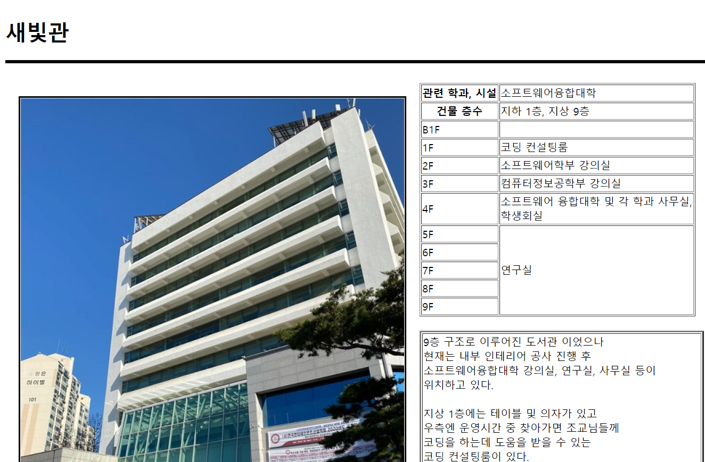

# Kakao Map API를 광운대학교 정보 지도

Kakao Map API를 이용하여 제작한 광운대학교 캠퍼스 내부 건물의 정보뿐 아니라, 주변 시설의 정보까지 알려주는 지도 프로그램입니다.

## 실행

[https://taedud.github.io/KW-InfoMap/](https://taedud.github.io/KW-InfoMap/)의 링크로 들어가시면 제작된 지도 페이지에 접속할 수 있습니다.
 

## 이용방법

 
처음 화면에서 좌측 상단에 위치한 메뉴 버튼을 클릭하여 원하시는 주변 시설의 위치를 볼 수 있습니다.
왼쪽 사이드바의 목록을 통해서도 시설을 선택하여 정보를 볼 수 있습니다.
 

## 안내 페이지

 
학교 건물을 클릭하면 뜨는 팝업창에서 '안내 페이지'버튼을 클릭하면 해당 건물의 층별 시설 목록과 간단한 건물 소개를 보실 수 있습니다.
 

## 오시는 길

 
학교 건물을 클릭하면 뜨는 팝업창에서 '오시는 길'버튼을 클릭하면 간단한 대중교통 시설에 관한 정보를 보실 수 있습니다.
 

## 중앙 도서관

 
80주년 기념관 건물을 클릭하시면 기존의 메뉴와 더불어 '중앙 도서관 안내'버튼을 보실 수 있습니다.
 

 
학교 도서관 홈페이지에 접속하거나 학교에서 제공하는 도서관 좌석 현황을 보실 수 있습니다.